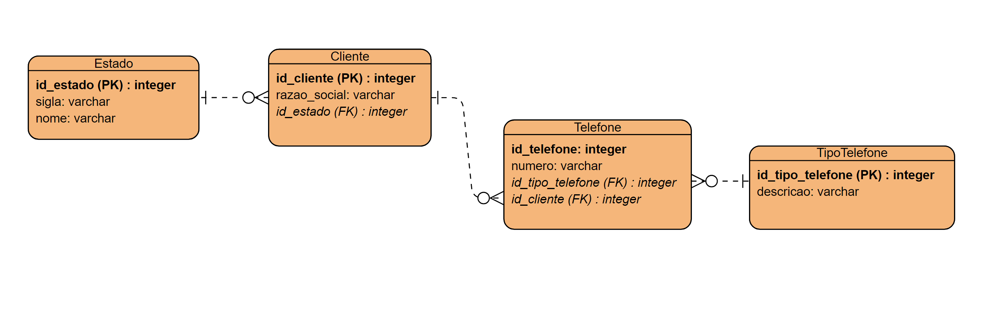

``# Resolução do Desafio 4 - Target Sistemas

## Descrição do Problema

A empresa solicitou um aplicativo para manutenção de um cadastro de clientes, onde:

- Um cliente pode ter múltiplos telefones;
- Cada telefone possui um tipo (ex: comercial, residencial, celular);
- Precisamos armazenar em qual estado brasileiro o cliente se encontra;
- O sistema permite cadastrar novos tipos de telefone e estados.

## Modelo Lógico do Banco de Dados

### Tabelas

1. **Cliente**:
 - `id_cliente` (PK): Chave primária para identificar o cliente.
 - `razao_social`: Nome ou razão social do cliente.
 - `id_estado` (FK): Referência para o estado onde o cliente se encontra.
  
2. **Telefone**:
 - `id_telefone` (PK): Chave primária para identificar o telefone.
 - `numero`: Número de telefone do cliente.
 - `id_tipo_telefone` (FK): Referência para o tipo de telefone (comercial, residencial, celular).
 - `id_cliente` (FK): Referência para o cliente que possui esse telefone.

3. **TipoTelefone**:
 - `id_tipo_telefone` (PK): Chave primária para identificar o tipo de telefone.
 - `descricao`: Descrição do tipo de telefone (ex: Comercial, Residencial, Celular).

4. **Estado**:
 - `id_estado` (PK): Chave primária para identificar o estado.
 - `sigla`: Sigla do estado (ex: SP, RJ).
 - `nome`: Nome completo do estado.

### Diagrama Relacional



### Chaves Primárias (PK) e Estrangeiras (FK)
-   **PK**:
    -   `id_cliente` na tabela **Cliente**.
    -   `id_telefone` na tabela **Telefone**.
    -   `id_tipo_telefone` na tabela **TipoTelefone**.
    -   `id_estado` na tabela **Estado**.
-   **FK**:
    -   `id_cliente` na tabela **Telefone** referencia `id_cliente` na tabela **Cliente**.
    -   `id_tipo_telefone` na tabela **Telefone** referencia `id_tipo_telefone` na tabela **TipoTelefone**.
    -   `id_estado` na tabela **Cliente** referencia `id_estado` na tabela **Estado**.

## Comando SQL

Abaixo está o comando SQL para buscar o código, a razão social e o(s) telefone(s) de todos os clientes que estão no estado de São Paulo (`sigla = 'SP'`):

````
SELECT 
    cliente.id_cliente, 
    cliente.razao_social, 
    telefone.numero AS telefone
FROM 
    cliente
JOIN 
    telefone ON cliente.id_cliente = telefone.id_cliente
JOIN 
    estado ON cliente.id_estado = estado.id_estado
WHERE 
    estado.sigla = 'SP';
````

### Explicação do Comando SQL:

1.  O comando **JOIN** é utilizado para unir as tabelas **Cliente**, **Telefone** e **Estado** com base nas chaves estrangeiras e primárias.
2.  O filtro **WHERE estado.sigla = 'SP'** garante que apenas os clientes do estado de São Paulo sejam retornados.
3.  O resultado inclui o `id_cliente`, `razao_social`, e o(s) `numero(s)` de telefone(s) associados.